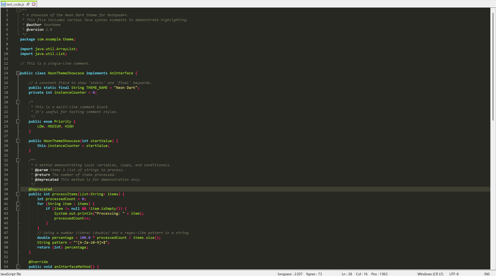

# Neon Dark for Notepad++

A port of the Neon Dark theme from the Eclipse IDE for Notepad++.

### Features

*   **Authentic Colors:** Faithfully reproduces the color palette from the original Eclipse theme.
*   **Full Language Support:** Includes syntax highlighting for all languages built into Notepad++.
*   **UI Fixes:** Corrects the common issue where the active tab text becomes unreadable.

---

### Installation

1.  Copy the `.xml` theme file.
2.  Open your Notepad++ themes directory by pasting `%APPDATA%\Notepad++\themes` into the Run dialog (`Win + R`).
3.  Place the file into that directory.
4.  Restart Notepad++ and select **Neon Dark** from `Settings > Style Configurator...`.

---
Licensed under the [MIT License](LICENSE).

